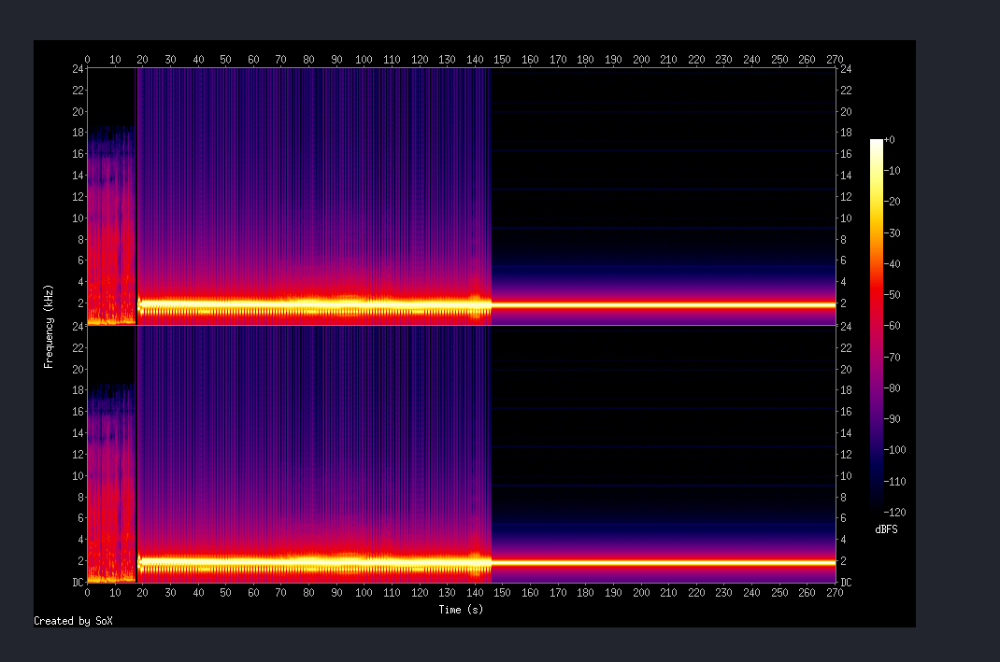

# CTF DFIR — momo Challenge Write-up

## The Story

A friend of **CR0M80** was chilling and listening to the radio station **ash.hadaFM** when suddenly he started hearing a really weird noise — something completely unrecognizable, not like regular music or speech. He had no idea what it was. The only clue CR0M80 could give him was a file called `momo.pdf`. Our job is to figure out what was going on and find the flag.

---

## Step 1 — Check the file type

The first thing I did is to check the type of the file. Just because something is named `.pdf` doesn't mean it actually is one.


IT's not a PDF it's a **WAV audio file** disguised with a `.pdf` extension. I renamed it properly.


---

## Step 2 — Checking if there is something hidden inside?

A WAV file disguised as a PDF is already suspicious. So there could be more data hidden inside. I used **Binwalk**, a tool that scans files looking for embedded/hidden content.


There are **3 things** in this file:
- The main WAV starting at offset `0`
- A **second WAV hidden at offset `5853262`**
- An **MP3 tag at offset `57718400`**

So there's definitely something buried inside. Let's dig it out.

---

## Step 3 — Extracting the Hidden WAV

I used Python to extract the hidden WAV — it's much faster than using `dd` byte by byte.


Let's check what we got:

```bash
file hidden2.wav
exiftool hidden2.wav
```

```
hidden2.wav: RIFF (little-endian) data, WAVE audio, Microsoft PCM, 16 bit, stereo 48000 Hz

File Size    : 52 MB
Encoding     : Microsoft PCM
Num Channels : 2
Sample Rate  : 48000
Duration     : 0:04:30
Warning      : Error reading RIFF file (corrupted?)
```

We have a **4 minute 30 second audio file** — but the header is corrupted. Let's fix that.

---

## Step 4 — Fixing the Corrupted Header

The file has a broken RIFF header. FFmpeg can repair it by re-encoding with a clean header.

```bash
ffmpeg -i hidden2.wav -ar 48000 -ac 2 -acodec pcm_s16le fixed.wav
```

After this, the file is clean and ready to analyze.

---

## Step 5 — What's Inside This Audio? (Spectrogram)

Instead of just listening, I generated a **spectrogram** — a visual representation of the frequencies present in the sound over time.

```bash
sox fixed.wav -n spectrogram -o momo_spectrogram.png
```



What I saw immediately:
- A **bright yellow line constantly at around 2 kHz** — this is a synchronization tone
- Colorful noise patterns above it — encoded image data
- Signal active from **0 to ~145 seconds**, then silence

This is the signature of **SSTV — Slow Scan Television**. SSTV is an old radio technique used to **transmit images over audio**. When you hear it, it sounds like a weird high-pitched noise — exactly what CR0M80's friend heard on the radio. Mystery solved on the scenario side.

---

## Step 6 — Preparing the Audio for SSTV Decoding

SSTV decoders work best with **mono audio**. I converted the stereo file:

```bash
sox fixed.wav -r 48000 -c 1 -b 16 -e signed-integer -L for_qsstv.wav
```

The `dither clipped` warning is harmless, ignore it.

---

## Step 7 — Decoding the SSTV Signal

I used **QSSTV**, a SSTV decoder available on Kali Linux:

```bash
qsstv
```

Inside QSSTV:
1. Go to `Options` → `Sound` → select **"from file"**
2. Load `for_qsstv.wav`
3. Click **Start**

QSSTV automatically detected the SSTV mode and decoded the image line by line — and there it was, the **flag revealed in the decoded image**.


---

## The Full Attack Chain

```
momo.pdf
   │
   ▼  file → it's actually a WAV
ctf_momo.wav
   │
   ▼  binwalk → second WAV hidden at offset 5853262
hidden2.wav  (corrupted header)
   │
   ▼  ffmpeg → header repaired
fixed.wav
   │
   ▼  sox spectrogram → confirmed SSTV signal at 2kHz
   │
   ▼  sox → converted to mono
for_qsstv.wav
   │
   ▼  QSSTV → SSTV decoded
FLAG 🎯
```

---

## What I Learned

**File extension spoofing** — Never trust an extension. Always run `file` on anything suspicious. Attackers and CTF creators love hiding files this way.

**Binwalk for hidden data** — When a file feels too big or suspicious, binwalk can reveal files embedded inside. It's one of the first tools to reach for in DFIR.

**SSTV — Slow Scan Television** — An analog image transmission protocol that encodes pictures as audio tones between roughly 1200–2300 Hz. When you hear that weird noise on a radio frequency, there's a good chance it's SSTV carrying an image.

**Spectrogram analysis** — Visualizing audio as a spectrogram is powerful. Hidden messages and encoded data often reveal themselves visually even when they sound like noise.

---

## Tools Used

| Tool | Purpose |
|------|---------|
| `file` | Detect real file type |
| `binwalk` | Find hidden embedded files |
| `python3` | Extract raw bytes from specific offset |
| `ffmpeg` | Repair corrupted WAV header |
| `sox` | Audio conversion + spectrogram generation |
| `exiftool` | Read file metadata |
| `qsstv` | Decode SSTV signal to image |

---

*Challenge solved ✅ — ST4F1T*
